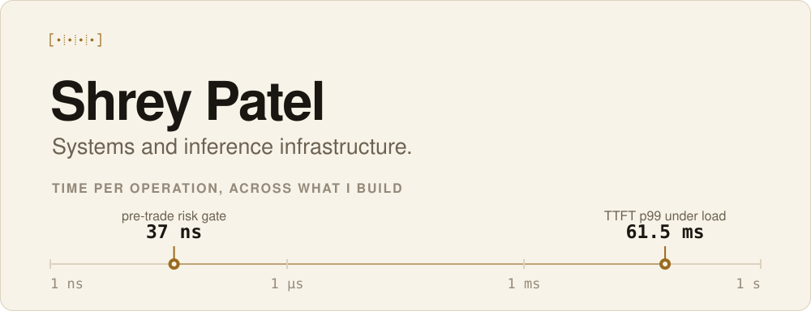

<picture>
  <source media="(prefers-color-scheme: dark)" srcset="https://raw.githubusercontent.com/ShreyPatel4/ShreyPatel4/main/assets/banner-dark.svg">
  <source media="(prefers-color-scheme: light)" srcset="https://raw.githubusercontent.com/ShreyPatel4/ShreyPatel4/main/assets/banner-light.svg">
  
</picture>

**This is my personal portfolio.**

I work on the parts of a system where the clock is the spec. Six orders of magnitude sit between the two numbers on that axis, and most of what I build lands somewhere along it. A risk check that has to clear before the order misses the market. A scheduler deciding which tenant gets the next slot on a GPU. A driver moving blocks off a wire without touching the heap.

Rust and C++ where latency is the product. Python and Go for the parts that have to still make sense a year later.

Boston. Looking for a full time systems or infrastructure role, and happy to relocate anywhere in the US.

---

## Numbers I can reproduce

Not stars. Every row is a measurement with a repo and a command behind it.

| Measurement | Result | Repo |
| :-- | :-- | :-- |
| Quiet-tenant TTFT p99 while a neighbor floods the same A100 | **1,585 ms → 61.5 ms**, back to 1.14x solo | [kvwarden](https://github.com/coconut-labs/kvwarden) |
| Pre-trade risk gate, 7 checks, `no_std` Rust, zero heap allocation | **37 ns**, 23M evals/sec, P99 42 ns | [risk-hotpath-hft](https://github.com/ShreyPatel4/risk-hotpath-hft) |
| Streaming replay of a generated trading day through that gate | **1.5M events/sec**, 780K events in 0.5 s | [risk-hotpath-hft](https://github.com/ShreyPatel4/risk-hotpath-hft) |
| Kappa pipeline on real AWS, deployed end to end, measured, torn down | 45 assertions, every claim mapped to an evidence tier | [realtime-analytics-004](https://github.com/ShreyPatel4/realtime-analytics-pipeline-engineer-004) |

---

## Selected work

<table>
<tr>
<td width="50%" valign="top">

### [kvwarden](https://github.com/coconut-labs/kvwarden)

Tenant-fair LLM inference on one GPU. Sits in front of vLLM or SGLang, rate-limits per tenant at admission, and keeps a quiet user fast while a noisy neighbor floods the same engine. Ten lines of YAML, no application code change.

Fills the gap between Ollama, which is single user, and Dynamo or llm-d, which want a datacenter.

`Python` `vLLM` `SGLang` `DRR` `token-bucket` `Grafana`

</td>
<td width="50%" valign="top">

### [risk-hotpath-hft](https://github.com/ShreyPatel4/risk-hotpath-hft)

A 500-line `no_std` Rust crate that clears pre-trade risk in 37 ns with zero heap allocations, plus the simulation harness that proves it: 120 symbols, 50 traders, streaming replay, live dashboard.

Config hot-swaps mid-stream with no P99 delta. Every check is property-tested.

`Rust` `no_std` `Criterion` `proptest` `Prometheus`

</td>
</tr>
<tr>
<td width="50%" valign="top">

### [realtime-analytics-004](https://github.com/ShreyPatel4/realtime-analytics-pipeline-engineer-004)

A real-time analytics rebuild for a Series-B martech company: design plus working artifacts that produce measured numbers. Deployed live on AWS, measured, then torn down.

Ships an evidence ledger that maps every claim to a tier, so nothing in it is inflated.

`AWS` `Kinesis` `Lambda` `Terraform` `Python`

</td>
<td width="50%" valign="top">

### [stage-0](https://github.com/ShreyPatel4/stage-0)

One canonical Stage-0 built exactly as a 2016-era Notion would have shipped it, broken to the smallest grain: block CRUD over FastAPI, Automerge CRDT merge service, Kafka fan-out, Meilisearch, auth, billing, dashboards.

`FastAPI` `Postgres` `Redis` `Kafka` `CRDT` `Meilisearch`

</td>
</tr>
<tr>
<td width="50%" valign="top">

### [UI-State-DOM-Capture](https://github.com/ShreyPatel4/UI-State-DOM-Capture-Multi-Agent)

Agents that drive a real browser through a natural-language task, track the flow in Postgres, and store screenshots and DOM snapshots in MinIO. Exports the whole run as a dataset.

`Python` `Playwright` `FastAPI` `Postgres` `MinIO`

</td>
<td width="50%" valign="top">

### [ArcBridge](https://github.com/ShreyPatel4/ArcBridge-Hybrid-Resource-Projection-and-Extension-Platform)

A hybrid management plane that connects many Kubernetes clusters to a central control plane and delivers platform extensions safely. Agent watches a CRD and reconciles, control plane owns registration and desired state.

`Go` `Kubernetes` `Helm` `OpenTelemetry` `k6`

</td>
</tr>
</table>

---

<b>More projects</b>

 

| Project | What it is | Stack |
| :-- | :-- | :-- |
| [FastLane_NVMe](https://github.com/ShreyPatel4/FastLane_NVMe) | Storage offload stack that exposes NVMe semantics to guests over RDMA, with FPGA-ready hooks | Rust, VFIO-user |
| [AMMIS](https://github.com/ShreyPatel4/Adaptive-Market-Microstructure-Intelligence-System-AMMIS-) | Reproducible C++20 workspace for latency-focused research: Conan, CMake, Google Benchmark, sanitizers | C++20, CMake, Conan |
| [dream_team](https://github.com/ShreyPatel4/dream_team) | A 31-agent engineering organization running as a daemon, with per-agent identity files and chat bridges | Python, agents |
| [Data-Kitchen (Nova)](https://github.com/ShreyPatel4/Data-Kitchen) | AI-native customer-VPC data platform. Four sprints shipped, then archived after an honest pre-customer review. Handoff doc included. | Python, Iceberg, FastAPI |
| [solution_SnowConvertAI](https://github.com/ShreyPatel4/solution_SnowConvertAI_final) | SQL Server to Snowflake migration with a verification harness and a head-to-head against SnowConvert AI | T-SQL, Snowflake |
| [Latent-Diffusion-Artbench](https://github.com/ShreyPatel4/Latent-Diffusion-Artbench-OpenImage) | Latent diffusion model trained from scratch on the full ArtBench dataset | PyTorch |

Data-Kitchen is archived on purpose. I would rather show the review that stopped it than pretend it is still alive.

<b>What I actually reach for</b>

 

| Layer | Tools |
| :-- | :-- |
| Systems | Rust (`no_std`, VFIO-user, RDMA), C++20, CMake, Conan, Criterion, proptest |
| Inference | vLLM, SGLang, token-bucket and DRR admission, per-tenant TTFT histograms |
| Data | Postgres, Kafka, Redis, Iceberg, Parquet, Meilisearch, MinIO, Snowflake |
| Cloud | AWS (Kinesis, Lambda, KMS), Kubernetes, Terraform, Helm, Cloudflare Workers |
| Observability | Prometheus, Grafana, OpenTelemetry, k6 |
| Everyday | Python, Go, FastAPI, Playwright, Docker, GitHub Actions |

<b>Recent pushes</b>

 
<!-- ACTIVITY_START -->

| Repo | Last commit | When |
| :-- | :-- | :-- |
| [ccocnutlabs-LP](https://github.com/coconut-labs/ccocnutlabs-LP) | unit G: ingestion data-contract guardrail (class G) — integrated | 2026-08-05 |

<!-- ACTIVITY_END -->

---

Reach me at [shreypatel@coconutlabs.org](mailto:patelshrey77@gmail.org) or  [patelshrey77@gmail.com](mailto:patelshrey77@gmail.com). Full time roles, contract work, or an argument about inference fairness. All three are welcome.
